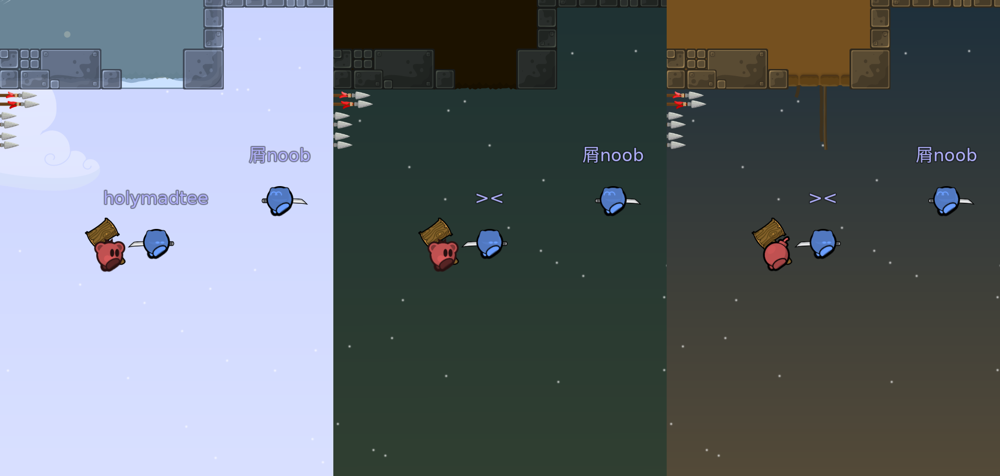

# demo-edit



## about

Change names, skins, maps and more of a teeworlds demo file. 

demo-edit is tested with demos of version 5 and 6 (ddnet), but theoreticly supports version 3 and 4 aswell. Only supports teeworlds 0.6 network protocol.

## compile

```sh
git clone https://github.com/johannesHHM/demo-edit
cd demo-edit
make
```

## run

```sh
./build/dedit --help
```

## examples

Under are a couple of examples that should run without issue after compiling.

Prints info of 'clip.demo'. Info consists of demo header and chunk counts.
```sh
./build/dedit testdata/clip.demo --info
```

Rename player with clientid 3 to 'holymadtee', change map to 'ice.map' and save the output to 'out.demo'.
```sh
./build/dedit testdata/clip.demo --rename 3 holymadtee --map testdata/ice.map --output out.demo
```

Set the skin of player with name 'New Hero' to 'bomb', rename 'New Hero' to 'Bob-omb', change map to 'jungle.map' and save the output to 'out.demo'.
```sh
./build/dedit testdata/clip.demo -s "New Hero" bomb -r "New Hero" Bob-omb -m testdata/jungle.map -o out.demo
```

Tip: 'out.demo' can be quickly viewed by running
```sh
DDNet out.demo
```

## help

```
Usage: dedit <demo> [OPTIONS]

Argument:
  <demo> Sets input demo

Options:
  -r, --rename        <id> <name>  Renames player with id to name
  -s, --skin          <id> <name>  Set skin of player with id to skin
  -m, --map           <map>        Changes the map of demo to map
  -e, --extract-map   <file>       Saves the map of demo to file
  -o, --output        <file>       Saves the output demo to file
  -i, --info                       Prints info of demo
  -I, --extended-info              Prints extended info of demo
  -h, --help                       Prints this help info
```

## credits

Some functions/implementations are heavily inspired by other sources. They are commented in the code with links to their referances. Under are some credits:

- [libtw2](https://github.com/heinrich5991/libtw2): variable length int implementation, demo/snapshot documentation
- [teeworlds](https://github.com/teeworlds/teeworlds): huffman implementation
- [ddnet](https://github.com/ddnet/ddnet): some demo writing specifics


